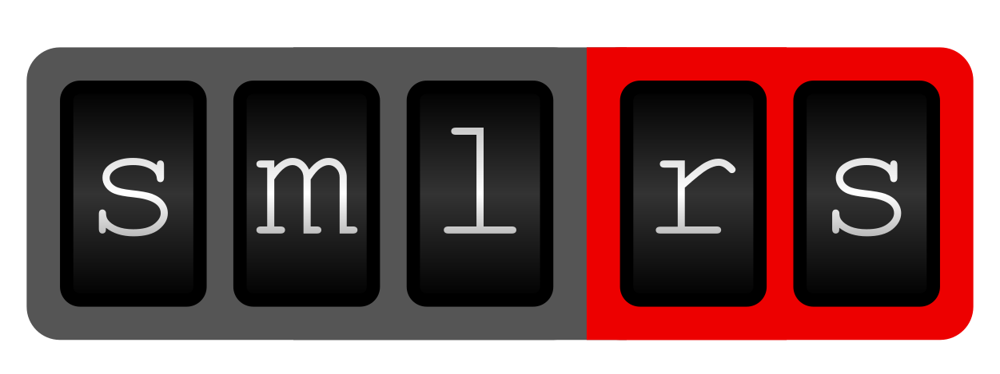

  
  

    
    
    
    
  

# *sml-rs*

Smart Message Language (SML) parser written in Rust.

Modern German power meters periodically send SML-encoded data via an optical interface. The main use-case of this library is to decode that data. 

**Status:** This library is ready to be used! We're still working on it and there may be breaking changes in the future, but the basics (transport encoding/decoding, parsing) are in good shape now. See section "Implementation Status" for details on the implementation status and be sure to let us know what you think about the library! Comments, feedback, issues, feature requests welcome!

## Design goals

The following list shows the goals guiding development of the library. While we haven't achieved all of them yet, the goal is to get there eventually. Feedback on the goals is greatly appreciated.

- **Practicality**: The main purpose of this library is to work seamlessly when reading SML data from power meters. Practicality includes means designing APIs that are accessible, resisting the temptation of going too fancy and implementing workarounds for buggy power meters.
- **Focus**: This library only implements the subset of SML that's actually used in power meters and can therefore be tested.
- **Correctness**: The implementation is correct according to the SML V1.04 Spec (see below). The only exception to this are workarounds for power meter bugs (see "Practicality"). The library only returns data that is complete and correct (verified by CRC checksums).
- **Efficiency**: The implementation should be as efficient as possible as long as that doesn't conflict with the previous goals.
- **Reliability**: The library does not crash / panic, even when provided malformed / malicious data. Every error is modeled in the API such that users of the library can decide what to do with the error. The library doesn't use `unsafe` Rust.
- **Completeness**: The library provides access to all data members that are part of the parsed SML data structures. It provides the data in a way that doesn't loose information (e.g. due to int-to-float conversions).
- **Testability**: The library aims for good test coverage, both in unit tests as well as using real-world data.
- **Learnability**: The library should be easy to use, which includes great examples and documentation.
- **Flexibility**: APIs should allow diverse use cases (e.g. decoding the transport layer only; parsing only; doing all at once using a simplified API; ...)
- **Embedded-Friendly**: The library works in `no_std` environments and can be used without an allocator.
- **DevOps-Friendly**: Dependencies are limited as much as possible. Non-essential dependencies are feature-gated. This provides good compile times and less surface for supply chain attacks.

- Non-goals:
  - Implementing the full SML spec, even though it isn't used anywhere.
  - Implementing encoding of SML Files (mainly because we don't have use-cases for it. If you need to encode SML data, let us know!)

## Spec

- SML V1.04 Spec [[pdf]][smlpdf] [[archive.org]][smlarchive]

## Implementation status

- [x] Transport v1
  - [x] Encode
  - [x] Encode streaming
  - [x] Decode
  - [x] Decode streaming
- [x] Parsing
  - [x] Complete (using allocations)
  - [x] Streaming (no_alloc compatible)
- [x] no_std / no_alloc support
- [ ] High-level APIs?
- [ ] Great documentation and examples (part done)
- [ ] Review (possibly tool-assisted) for panic paths.
- [ ] ...

#### License

Licensed under either of <a href="LICENSE-APACHE">Apache License, Version
2.0</a> or <a href="LICENSE-MIT">MIT license</a> at your option.

 

Unless you explicitly state otherwise, any contribution intentionally submitted
for inclusion in this crate by you, as defined in the Apache-2.0 license, shall
be dual licensed as above, without any additional terms or conditions.

[smlpdf]: https://www.bsi.bund.de/SharedDocs/Downloads/DE/BSI/Publikationen/TechnischeRichtlinien/TR03109/TR-03109-1_Anlage_Feinspezifikation_Drahtgebundene_LMN-Schnittstelle_Teilb.pdf;jsessionid=F2323041EE7292926D80680DA407BA3F.internet082?__blob=publicationFile&v=1
[smlarchive]: https://web.archive.org/web/20211217153839/https://www.bsi.bund.de/SharedDocs/Downloads/DE/BSI/Publikationen/TechnischeRichtlinien/TR03109/TR-03109-1_Anlage_Feinspezifikation_Drahtgebundene_LMN-Schnittstelle_Teilb.pdf;jsessionid=F2323041EE7292926D80680DA407BA3F.internet082?__blob=publicationFile&v=1